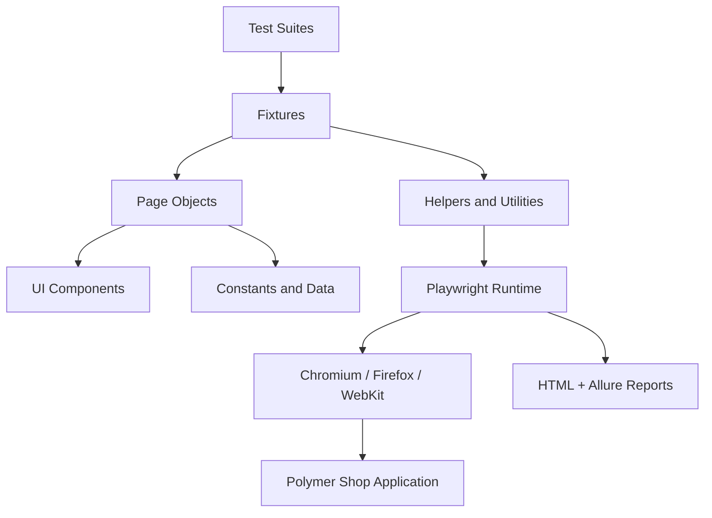

# Playwright Polymer Shop Automation Framework

Playwright + TypeScript test automation for the Polymer Shop demo site, with deterministic UI flows, cross-browser projects, reporting, and CI security checks.


[](https://github.com/PawankumarKharpude27/playwright-polymer-shop-framework/actions/workflows/playwright.yml)
[](https://github.com/PawankumarKharpude27/playwright-polymer-shop-framework/actions/workflows/security.yml)
[](LICENSE)


## What This Demonstrates

This repository demonstrates maintainable Playwright structure around a public demo shop: page and component objects, shared fixtures, data-backed test flows, browser projects, failure artifacts, and CI checks.

## Scope

The target is a public demo application, so the suite focuses on browser behavior and lightweight HTTP contract checks. The repository uses one configured `dev` target until additional systems exist.

## Architecture overview

```text
tests/                -> smoke / sanity / regression suites
pages/                -> page objects for each application page
components/           -> reusable UI components
fixtures/             -> custom Playwright fixtures
helpers/              -> logger, retry-aware utilities
utils/                -> assertions, waits, screenshots, state capture
constants/            -> routes, selectors, and shared values
data/                 -> JSON-driven test data
config/               -> environment configuration
reports/              -> HTML + Allure outputs
.github/workflows/    -> CI and security workflows
```

### Architecture diagram



## Framework highlights

- Page Object Model and Component Object Model
- Reusable fixtures and abstraction layers
- Cross-browser and mobile execution
- HTML, Allure, screenshot, video, and trace reporting on failure
- Environment configuration using dotenv with a single `baseURL` source
- Stronger assertions and reusable utilities for maintainable tests
- Gitleaks and dependency auditing in CI
- Deterministic regression coverage for responsive navigation

## Tech stack

- Playwright Test
- TypeScript
- Node.js
- dotenv
- Allure
- GitHub Actions
- Winston logging

## Project structure

- pages/: page objects for home, category, product, and cart flows
- components/: shared UI components such as header and footer
- fixtures/: test fixture wiring for application objects
- utils/: reusable helpers for waits, assertions, screenshots, and context capture
- constants/: centralized routes and selectors
- data/: JSON-driven test data for products and users
- config/: environment management
- reports/: outputs for execution artifacts and reporting

## Installation

```bash
npm install
npx playwright install --with-deps
```

## Local execution

```bash
npm test
npm run test:smoke
npm run test:sanity
npm run test:regression
npm run test:headed
npm run test:debug
```

## Cross-browser execution

```bash
npx playwright test --project=chromium
npx playwright test --project=firefox
npx playwright test --project=webkit
npx playwright test --project=mobile-chromium
```

## Reporting

```bash
npm run report
npm run allure:report
```

## CI/CD

The repository includes:
- a Playwright workflow for automated execution on push and pull request
- a security workflow for dependency auditing and secret scanning
- artifact upload for HTML reports, test results, and Allure output

## Security posture

Security considerations are built into the repository by design:
- secrets stay in environment variables and example files only
- dependency auditing is part of CI
- logs and artifacts are kept clean and non-sensitive
- the repo includes a dedicated security policy

## How to evaluate this project (quick)

If a recruiter or technical reviewer wants to validate the project quickly, these three steps allow them to confirm quality in under 5 minutes:

1) Run the smoke suite locally (installation steps above).

```bash
npm install
npx playwright install --with-deps
npm run test:smoke
```

2) Open the HTML report or Allure report generated by a run. Example:

```bash
npm run report
# or
npm run allure:report
```

3) Inspect these files in the repo: `playwright.config.ts`, `fixtures/base.ts`, `pages/home.page.ts`, and `utils/test-context.ts`. These show the architecture and coding style.

## CV blurb (copy/paste)

Playwright + TypeScript SDET framework for the Polymer Shop demo site — designed as an enterprise-grade portfolio project. Implements Page Object Model and Component Object Model, custom Playwright fixtures, cross-browser execution, Allure and HTML reporting, CI with GitHub Actions, and security checks. (Link: https://github.com/PawankumarKharpude27/playwright-polymer-shop-framework)

## Custom engineering-style utility

The framework includes a lightweight context-capture utility in [utils/test-context.ts](utils/test-context.ts) that captures the current URL and page title for better debugging and more intentional error reporting.

## Demo preview


## Pre-push checklist

Before pushing to GitHub, confirm the following:
- [ ] all tests pass locally
- [ ] dependency audit is clean
- [ ] security workflow is configured and visible
- [ ] README and ownership details are complete
- [ ] no secrets are committed
- [ ] reports and local artifacts are not published unintentionally
- [ ] the repository looks polished enough for recruiter and hiring-manager review
